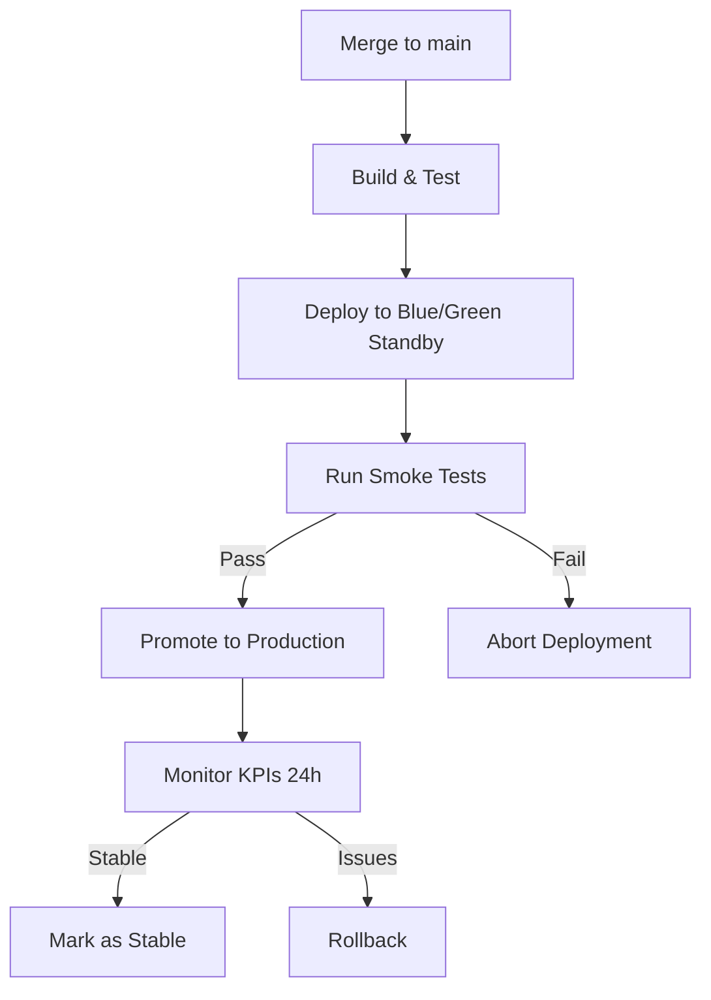
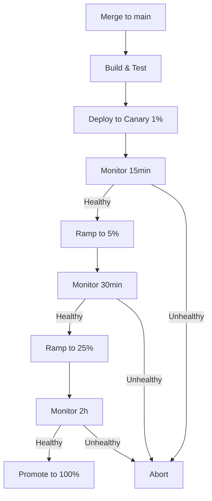
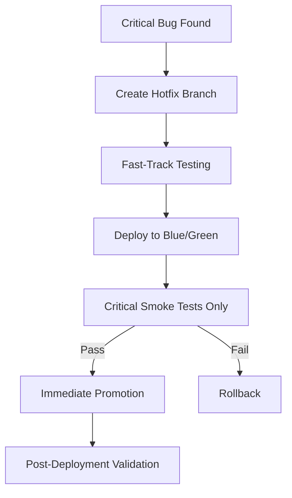

# Deployment Strategy

Enterprise-grade deployment practices for ORCA Platform: canary releases, blue/green deployments, automated rollbacks, and smoke testing.

---

## Overview

ORCA supports multiple deployment strategies to minimize risk and downtime:

1. **Canary Releases** - Gradual traffic shifting with automated monitoring
2. **Blue/Green Deployments** - Zero-downtime environment swaps
3. **Automated Rollbacks** - Quick revert on failure detection
4. **Smoke Tests** - Fast validation of critical functionality

All strategies integrate with KPI monitoring and alerting to catch issues early.

---

## 1. Canary Deployments

**Implementation**: `deploy/canary_router.ts`

### How It Works

1. Deploy new version to canary environment (small subset of infrastructure)
2. Route percentage of traffic to canary based on strategy
3. Monitor KPIs (error rate, latency, throughput)
4. Gradually increase traffic if healthy, abort if degraded
5. Promote to 100% when stable

### Configuration

```env
# Enable canary
CANARY_ENABLED=true
CANARY_PERCENTAGE=10  # 0-100

# Routing strategy
CANARY_STRATEGY=percentage  # percentage | header | user-id | tenant-id

# Header-based routing
CANARY_HEADER_KEY=X-Canary-Route
# Usage: curl -H "X-Canary-Route: true" http://api.orca.example/...

# User/Tenant whitelisting
CANARY_WHITELIST=user-123,user-456
CANARY_BLACKLIST=user-789

# KPI thresholds
CANARY_MAX_ERROR_RATE=5.0  # Percentage
CANARY_MAX_P95_LATENCY=1000  # Milliseconds
CANARY_MIN_REQUESTS=100  # Minimum traffic for evaluation
```

### Routing Strategies

**Percentage** (default):
- Deterministic hash-based routing
- Sticky per user (same user always gets same version)
- Gradually increase: 1% → 5% → 10% → 25% → 50% → 100%

**Header**:
- Override routing with HTTP header
- Useful for QA testing: `X-Canary-Route: true`

**User ID**:
- Whitelist specific users (internal team, beta testers)
- Blacklist high-value customers initially

**Tenant ID**:
- Multi-tenant canary (route entire tenants)
- Test with internal tenant first

### Usage

```typescript
import { canaryRouter } from './deploy/canary_router.js';

// Express middleware
app.use(canaryRouter('http://canary.orca.internal:3000'));

// Request handler can check canary flag
app.get('/api/workflows', (req, res) => {
  if (req.canaryRoute) {
    // Canary-specific logic or metrics
  }
});
```

### Monitoring & Promotion

```typescript
import { checkCanaryHealth, rampUpCanary, abortCanary } from './deploy/canary_router.js';

// Check canary KPIs
const health = await checkCanaryHealth(canaryVersion);

if (health.healthy) {
  // Ramp up traffic
  const newPercentage = await rampUpCanary(10, 10); // current=10%, step=10%
  console.log(`Canary traffic increased to ${newPercentage}%`);
} else {
  // Abort and rollback
  await abortCanary(health.reason);
}
```

### Ramp-Up Schedule (Recommended)

| Stage | Percentage | Duration | Action on Failure |
|-------|-----------|----------|-------------------|
| 1     | 1%        | 15 min   | Abort immediately |
| 2     | 5%        | 30 min   | Abort immediately |
| 3     | 10%       | 1 hour   | Abort, investigate |
| 4     | 25%       | 2 hours  | Rollback |
| 5     | 50%       | 4 hours  | Rollback |
| 6     | 100%      | Stable   | Promote |

**Automated**: Use CI/CD pipeline with Prometheus alerts to trigger ramp-up or abort.

---

## 2. Blue/Green Deployments

**Implementation**: `deploy/blue_green_promote.ts`

### How It Works

1. **Blue** = Current production environment
2. **Green** = New version deployed to standby environment
3. Run smoke tests on green
4. Check green meets KPI thresholds
5. Switch load balancer/DNS to green (instant cutover)
6. Drain blue connections gracefully
7. Blue becomes new standby for next deployment

### Configuration

```env
# Current active environment
ACTIVE_ENV=blue  # or green

# Environment URLs
BLUE_ENV_URL=http://blue.orca.internal
GREEN_ENV_URL=http://green.orca.internal

# Versions
BLUE_VERSION=1.0.2
GREEN_VERSION=1.0.3

# Promotion criteria
PROMOTION_MIN_UPTIME=99.5  # Percentage
PROMOTION_MAX_ERROR_RATE=1.0  # Percentage
PROMOTION_MAX_P95_LATENCY=500  # Milliseconds
PROMOTION_MAX_P99_LATENCY=1000  # Milliseconds
PROMOTION_MIN_REQUESTS=100  # Minimum traffic

# Drain settings
DRAIN_TIMEOUT_SECONDS=60  # Max time to wait for connections to close
```

### Promotion Process

```typescript
import { promoteEnvironment } from './deploy/blue_green_promote.ts';

// Dry run (check eligibility without promoting)
const dryRun = await promoteEnvironment(true);
console.log(dryRun.message);

// Execute promotion
const result = await promoteEnvironment(false);
if (result.success) {
  console.log('Promotion successful:', result.message);
} else {
  console.error('Promotion failed:', result.message);
}
```

### Promotion Criteria Checks

Before promotion, standby must pass:

1. ✅ **Health Check** - `/api/health` returns 200
2. ✅ **Uptime** - ≥99.5% over last hour
3. ✅ **Error Rate** - ≤1.0%
4. ✅ **P95 Latency** - ≤500ms
5. ✅ **P99 Latency** - ≤1000ms
6. ✅ **Traffic Volume** - ≥100 requests (validates production-like load)
7. ✅ **Smoke Tests** - All critical tests passed

If any check fails, promotion is blocked automatically.

### Emergency Rollback

```typescript
import { rollbackEnvironment } from './deploy/blue_green_promote.ts';

// Instant rollback (no checks)
const result = await rollbackEnvironment();
console.log(result.message);
```

---

## 3. Automated Rollbacks

**Implementation**: `deploy/rollback.ts`

### When to Rollback

**Automatic triggers**:
- Error rate spike (>5%)
- Latency spike (P95 > 2x baseline)
- Critical smoke test failure
- Health check failure for >5 minutes
- Manual emergency trigger

**Manual triggers**:
- Customer-reported critical bug
- Security vulnerability discovered
- Data integrity issue

### Rollback Process

```typescript
import { generateRollbackPlan, executeRollback } from './deploy/rollback.ts';

// 1. Generate rollback plan
const plan = await generateRollbackPlan(); // Auto-selects previous stable version
// Or specify version: generateRollbackPlan('deploy-002');

console.log('Rollback Plan:');
console.log(`  From: ${plan.currentVersion.version}`);
console.log(`  To: ${plan.targetVersion.version}`);
console.log(`  Steps: ${plan.steps.length}`);
console.log(`  Estimated duration: ${plan.estimatedDuration}s`);
console.log(`  Risks: ${plan.risks.join(', ')}`);

// 2. Dry run
const dryRunResult = await executeRollback(plan, true);

// 3. Execute
const result = await executeRollback(plan, false);
if (result.success) {
  console.log('Rollback successful');
} else {
  console.error('Rollback failed:', result.message);
}
```

### Rollback Steps

1. **Database Migration Rollback** (if applicable)
   - Reverse migrations to target version
   - Reversible: Yes (depends on migration)
   - Duration: ~30s

2. **Application Rollback**
   - Deploy previous Docker image
   - Update Kubernetes/ECS deployments
   - Reversible: Yes
   - Duration: ~60s

3. **Configuration Rollback**
   - Restore previous ConfigMaps/Secrets
   - Reversible: Yes
   - Duration: ~10s

4. **Validation**
   - Run smoke tests
   - Check error rates
   - Reversible: N/A
   - Duration: ~120s

### Emergency Rollback

```typescript
import { emergencyRollback } from './deploy/rollback.ts';

// Skip validation steps for speed
const result = await emergencyRollback();
```

**Use when**:
- Production outage in progress
- Data loss risk
- Security breach

**Characteristics**:
- Skips non-critical validation
- Fastest possible revert (typically <2 minutes)
- Post-rollback validation still runs
- Triggers critical alerts

---

## 4. Smoke Tests

**Implementation**: `deploy/smoke_tests.ts`

### Test Categories

| Category | Tests | Critical | Timeout |
|----------|-------|----------|---------|
| **API** | Health check, version | Yes | 5s |
| **Database** | Connection, query | Yes | 10s |
| **Auth** | JWT generation, API key | Yes | 3s |
| **Features** | Workflows, agents, KPIs | No | 10s |
| **Integrations** | Supabase, external APIs | Partial | 5s |

### Running Smoke Tests

**CLI**:
```bash
# All tests
npm run smoke:test

# Critical only
npm run smoke:test -- --critical

# Exit codes:
# 0 = all tests passed
# 1 = one or more tests failed
```

**Programmatic**:
```typescript
import { runSmokeTests } from './deploy/smoke_tests.js';

const report = await runSmokeTests(false); // false = all tests, true = critical only

console.log(report.summary);
// "8/9 tests passed, 1 failed in 1234ms"

if (!report.passed) {
  for (const result of report.results.filter(r => !r.passed)) {
    console.error(`❌ ${result.test.name}: ${result.error}`);
  }
}
```

### CI/CD Integration

```yaml
# .github/workflows/deploy.yml
- name: Deploy to staging
  run: |
    npm run deploy:staging

- name: Run smoke tests
  run: |
    npm run smoke:test
  timeout-minutes: 5

- name: Rollback on failure
  if: failure()
  run: |
    npm run deploy:rollback
```

### Adding Custom Tests

```typescript
// deploy/smoke_tests.ts

const smokeTests: SmokeTest[] = [
  // ... existing tests ...
  {
    id: 'custom-feature',
    name: 'Custom Feature Check',
    category: 'api',
    timeout: 5000,
    critical: false,
  },
];

// Implement test
async function testCustomFeature(): Promise<void> {
  const response = await fetch(`${baseUrl}/api/custom`);
  if (!response.ok) throw new Error('Custom feature not responding');
}
```

---

## 5. Deployment Workflows

### Standard Release (Low Risk)



**Steps**:
1. Deploy new version to standby environment
2. Run full smoke test suite
3. Check KPI thresholds
4. Promote if all checks pass
5. Monitor for 24 hours
6. Mark as stable if no issues

### High-Risk Release (New Feature)



**Steps**:
1. Start with 1% canary traffic
2. Monitor error rate, latency, user feedback
3. Gradually increase if KPIs healthy
4. Abort and rollback on first sign of issues
5. Full promotion only after extended monitoring

### Hotfix (Emergency)



**Steps**:
1. Skip canary (too slow for emergency)
2. Use blue/green for instant cutover
3. Run only critical smoke tests
4. Promote immediately if tests pass
5. Extended monitoring post-deployment

---

## 6. KPI Monitoring

### Deployment Health Metrics

**Error Rate**:
```
(5xx responses + client errors) / total requests * 100
```
- Threshold: <1% steady-state, <5% during rollout
- Alert: >2% for 5 minutes

**Latency (P95)**:
```
95th percentile response time
```
- Threshold: <500ms
- Alert: >1000ms or >2x baseline

**Throughput**:
```
Requests per second
```
- Threshold: ≥80% of baseline
- Alert: <50% of baseline

**Uptime**:
```
Successful health checks / total health checks * 100
```
- Threshold: ≥99.9%
- Alert: <99.5%

### Monitoring Tools

**Prometheus Queries**:
```promql
# Error rate
rate(http_requests_total{status=~"5.."}[5m]) / rate(http_requests_total[5m]) * 100

# P95 latency
histogram_quantile(0.95, rate(http_request_duration_seconds_bucket[5m]))

# Request rate
rate(http_requests_total[5m])
```

**Grafana Dashboards**:
- Deployment health dashboard (see `deploy/grafana_dashboard.json`)
- Canary comparison dashboard
- Rollback history

---

## 7. Best Practices

### Before Deployment

✅ **Test in staging** - Identical to production
✅ **Run migrations** - Test rollback scenarios
✅ **Update docs** - Especially if API changes
✅ **Schedule** - Avoid peak hours (weekdays 9-5)
✅ **Notify stakeholders** - Slack announcement
✅ **Prepare rollback plan** - Know how to revert

### During Deployment

✅ **Monitor continuously** - Dashboard + Slack alerts
✅ **Communicate status** - Update deployment ticket
✅ **Test critical paths** - Manual QA if needed
✅ **Check logs** - Watch for errors or warnings

### After Deployment

✅ **Extended monitoring** - 24-48 hours
✅ **User feedback** - Check support tickets
✅ **Performance review** - Compare to baseline
✅ **Mark stable** - Update deployment record
✅ **Retrospective** - Document lessons learned

---

## 8. Troubleshooting

### Canary stuck at low percentage

**Symptoms**: Canary at 5%, won't ramp up

**Causes**:
- KPIs not meeting thresholds
- Insufficient traffic (< min requests)
- Automation disabled

**Solutions**:
1. Check KPIs: `npm run canary:check`
2. Review Prometheus alerts
3. Manually validate canary endpoint
4. If stable, force ramp: `CANARY_PERCENTAGE=10`

### Blue/green promotion blocked

**Symptoms**: Promotion fails with "not eligible"

**Causes**:
- Smoke tests failed
- KPIs below threshold
- Health check failing

**Solutions**:
1. Run smoke tests: `npm run smoke:test`
2. Check environment health: `curl http://green.orca.internal/api/health`
3. Review logs for errors
4. If safe, override: `npm run promote -- --force`

### Rollback failed mid-way

**Symptoms**: Rollback stopped at step 2/4

**Causes**:
- Database migration conflict
- Deployment command failed
- Infrastructure issue

**Solutions**:
1. Check rollback logs
2. Manually complete remaining steps
3. Emergency rollback: `npm run deploy:emergency-rollback`
4. If production down, restore from backup

### Smoke tests timeout

**Symptoms**: Tests hang, CI job killed

**Causes**:
- Database connection pool exhausted
- Dependent service down
- Network issue

**Solutions**:
1. Check dependencies: DB, Redis, Supabase
2. Increase timeout: `SMOKE_TEST_TIMEOUT=30000`
3. Run tests locally to isolate issue
4. Skip non-critical tests: `npm run smoke:test -- --critical`

---

## 9. Deployment Checklist

**Pre-Deployment**:
- [ ] All tests passing (unit, integration, e2e)
- [ ] Code review approved
- [ ] Changelog updated
- [ ] Database migrations tested (forward + rollback)
- [ ] Staging deployment successful
- [ ] Rollback plan documented
- [ ] Stakeholders notified

**Deployment**:
- [ ] Deploy to standby environment
- [ ] Run smoke tests
- [ ] Check KPIs
- [ ] Promote or ramp up canary
- [ ] Monitor for anomalies

**Post-Deployment**:
- [ ] Verify production health
- [ ] Check error rates and latency
- [ ] Review user-facing features
- [ ] Monitor for 24 hours
- [ ] Close deployment ticket
- [ ] Update runbooks if needed

---

## Resources

- **Implementations**:
  - [canary_router.ts](../deploy/canary_router.ts)
  - [blue_green_promote.ts](../deploy/blue_green_promote.ts)
  - [rollback.ts](../deploy/rollback.ts)
  - [smoke_tests.ts](../deploy/smoke_tests.ts)

- **Monitoring**:
  - Prometheus: `http://prometheus.orca.internal:9090`
  - Grafana: `http://grafana.orca.internal:3000`

- **Runbooks**:
  - [Deployment failure](../incident/RUNBOOKS/deployment_failure.md)
  - [Rollback procedure](../incident/RUNBOOKS/rollback_procedure.md)

- **External**:
  - [Google SRE Book: Canarying](https://sre.google/workbook/canarying-releases/)
  - [Martin Fowler: Blue/Green](https://martinfowler.com/bliki/BlueGreenDeployment.html)
